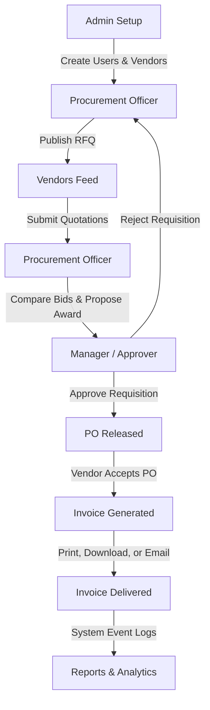

# VendorBridge ERP – Complete Business Flow

This document outlines the end-to-end operational procurement workflow implemented in the **VendorBridge ERP** platform. It details role responsibilities, input criteria, state transitions, and documents generated.

---

## High-Level Workflow Diagram

---

## Detailed Step-by-Step Operations

### Step 1: System Configuration & User Setup
* **Actor**: Admin
* **Actions**:
  * Registers/logs into the administrative workspace.
  * Adds target users and credentials (Procurement Officers, Managers, and Vendors).
  * Creates commercial profiles for Vendors (Category, Company Name, GST number, and Phone).
* **Output**: User permissions and profile records initialized in database.

### Step 2: Request for Quotation (RFQ) Requisition
* **Actor**: Procurement Officer
* **Actions**:
  * Defines requisition title and description.
  * Inputs required quantity and sets target budgets.
  * Chooses bid deadline closing date.
  * Assigns specific vendors to invite (defaults to all approved vendors).
* **System Actions**:
  * Automatically generates RFQ numbers and triggers notification alerts.
* **Output**: Requisition state updated to `Open`.

### Step 3: Vendor Bid Submission
* **Actor**: Vendor
* **Actions**:
  * Views invitations in the RFQ feed.
  * Submits commercial pricing quotation, specifying delivery days and custom remarks.
* **Output**: Quotation state updated to `Submitted`.

### Step 4: Quotation Evaluation & Comparison
* **Actor**: Procurement Officer
* **Actions**:
  * Opens the RFQ details sheet.
  * Reviews side-by-side matrices (highlights lowest cost, shortest timeline, and vendor ratings).
  * Submits an award recommendation to the manager with justification.
* **Output**: Quotation state updated to `Under Review`.

### Step 5: Procurement Approvals Workflow
* **Actor**: Manager (Finance Director)
* **Actions**:
  * Inspects the details, prices, comparisons, and technical remarks.
  * **Approve**: Releases requisition for PO generation.
  * **Reject**: Routes requisition back to procurement for revisions.
* **Output**: Approval task state updated to `Approved` or `Rejected`.

### Step 6: Purchase Order (PO) Release
* **Actor**: Procurement Officer
* **Actions**:
  * Opens the approved quotation.
  * Clicks "Generate PO".
* **System Actions**:
  * Issues automatic PO numbers (e.g. `PO-2026-0001`), aggregates rates, and formats the contract.
* **Output**: PO released to the vendor.

### Step 7: PO Acceptance
* **Actor**: Vendor
* **Actions**:
  * Views released Purchase Orders.
  * Reviews terms and clicks **Accept PO** to start delivery logistics.
* **Output**: PO state updated to `Accepted`.

### Step 8: Tax Invoice Generation
* **Actor**: Vendor / Procurement Officer
* **Actions**:
  * Opens the completed PO contract.
  * Clicks **Generate Invoice**.
* **System Actions**:
  * Calculates tax breakdowns (adds 18% GST onto subtotal) and formats the invoice.
* **Output**: Invoice created in `Sent` status.

### Step 9: PDF, Print & Email Dispatches
* **Actor**: Procurement Officer / Manager
* **Actions**:
  * Download PDF summary.
  * Print invoice (using print CSS stylesheets).
  * Email invoice (simulates Nodemailer server-side delivery).
* **Output**: Invoice delivered to billing contacts.

### Step 10: Activity Logging
* **Actor**: System (Tracks All Users)
* **Actions**:
  * Writes audit log history trails for creations, bids, reviews, approvals, invoice releases, and payments.
* **Output**: Audit trail spreadsheet records.

### Step 11: Reports & Analytics
* **Actor**: Admin & Manager
* **Actions**:
  * Inspects total spends, active vendors, monthly transaction charts, and categories.
  * Exports reports as spreadsheet files (CSV exports).
